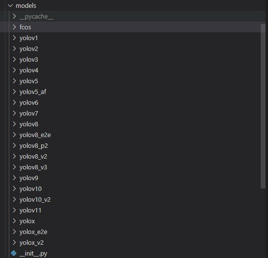
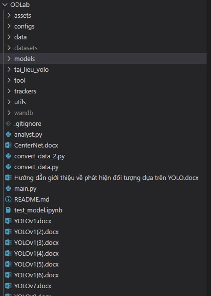
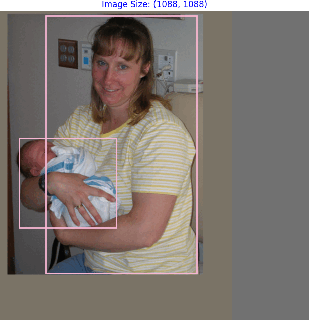
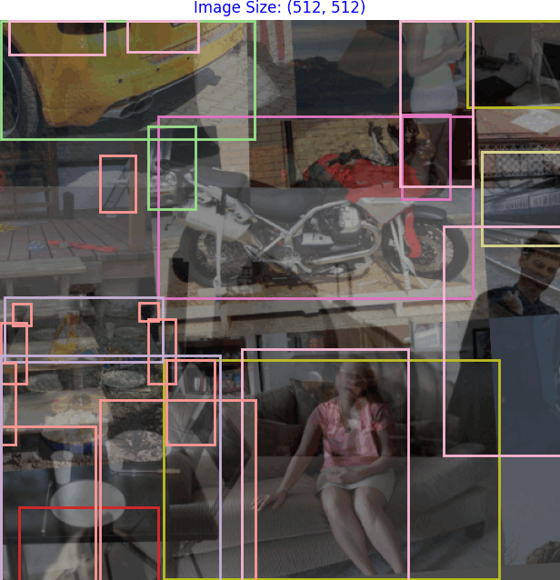
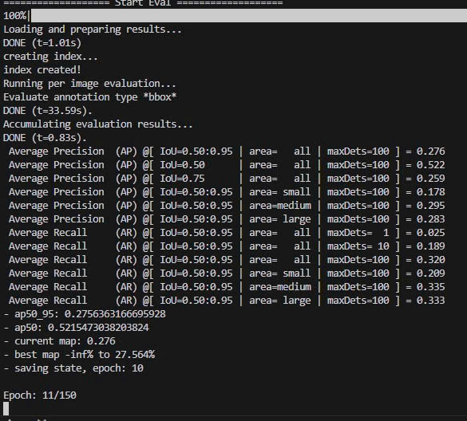

# Object Detection
This repository is a collection of deep learning applications for object detection.


```bash
python main.py --yaml_config configs/yolov1/voc.yaml
```

## Info
+ The repository includes YOLO versions from YOLOv1 to YOLOv11 and YOLOX.
+ The dataset supports data processing in the following formats: VOC, COCO, YOLO.
+ Dataset augmentation options include YOLO-style augmentation (yolo_aug) and SSD-style augmentation (ssd_aug).
+ Model performance evaluation is available using mAP metrics and confusion matrix analysis.
+ Various models trained with multi-scale settings

## Research Models


## Structure



## Demo
Dataset Augmentation:
+ SSD Augmentation


+ Yolo Augmentation


Model Performance Evaluation
+ mAP metric:
<p align='center'>
    
</p>

+ Confusion matrix:
<p align='center'>
    
</p>

## Demo

### Test .pth & .onnx Model
```bash
voila "test_model.ipynb" --port 8866 --Voila.ip 127.0.0.1 --show_tracebacks=True
```

## Installation

To use these applications, you need to have Python and several Python packages installed. To install the required packages, use the following command:
```bash
pip install -r requirements.txt"
```